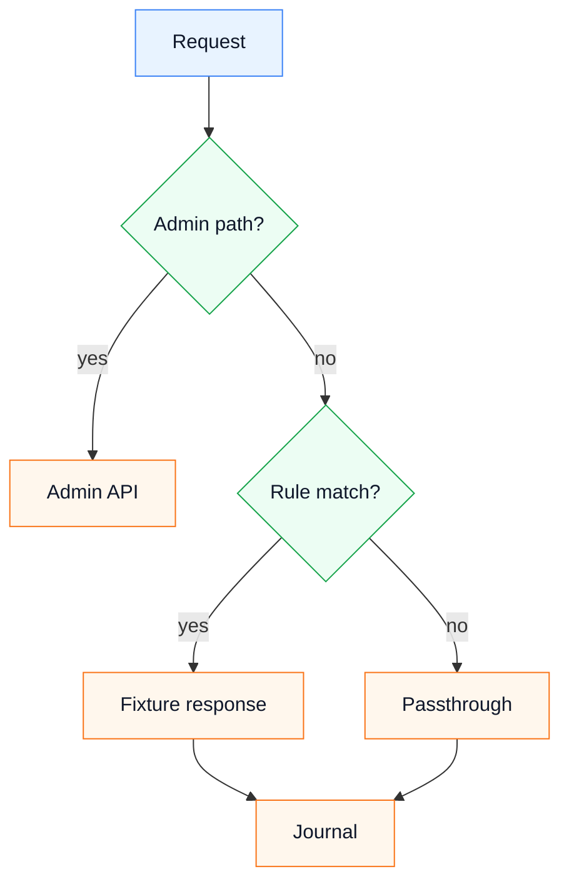

# MCP Proxy Agent Guide

This project is a generic Kotlin JVM service for local MCP-controlled proxy testing.

## Architecture

- `domain` contains value objects, runtime contracts, scenario models, Android and CA contracts.
- `application` contains use cases and orchestration.
- `infrastructure` contains Ktor/MITM proxy runtime, scenario file loading, MCP adapters, logging, CA, ADB and process execution.
- `app` contains launcher parsing, dependency wiring and output.

Keep domain-specific behavior outside the base proxy unless the architecture explicitly introduces a reusable extension point.

## Request Flow

The proxy handles admin endpoints first, then tries active scenario rules, then falls back to upstream passthrough.

## Important Files

- `src/main/kotlin/dev/mcp/proxy/app/LauncherArgumentsParser.kt`
- `src/main/kotlin/dev/mcp/proxy/application/*UseCase.kt`
- `src/main/kotlin/dev/mcp/proxy/domain/scenario/*`
- `src/main/kotlin/dev/mcp/proxy/infrastructure/server/MitmMockProxyServer.kt`
- `src/main/kotlin/dev/mcp/proxy/infrastructure/mcp/GenericProxyMcpServer.kt`
- `src/main/kotlin/dev/mcp/proxy/infrastructure/scenario/FileScenarioRepository.kt`
- `src/main/resources/admin/*`

## State Store

Use MCP `state_get`, `state_set`, `state_delete` and `state_list` for generic JSON state. Files are stored in `stateDirectory/kv`. The base project intentionally avoids business-specific state mutations.

## Verification

Run inspections first according to repository rules, then `./gradlew --no-daemon test`. When launcher, Docker or Compose changes, also run `./gradlew --no-daemon installDist` and verify Docker/MCP startup.
