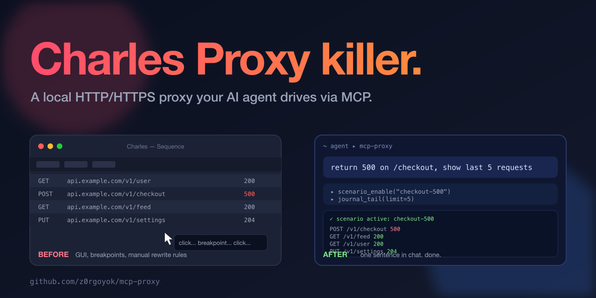
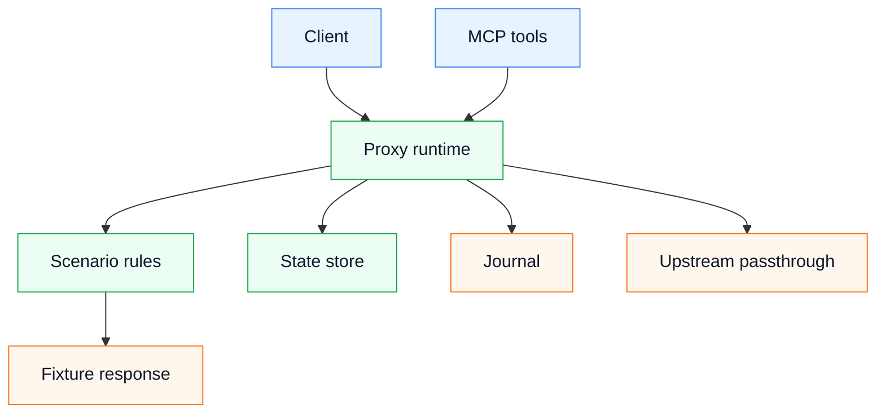

<p align="center">
  
</p>

# MCP Proxy

`mcp-proxy` is a local scenario-driven HTTP/HTTPS proxy for client testing. It can run as an MCP server, switch active scenarios, serve JSON fixtures, pass unknown requests to an upstream service, record a request journal, and keep small JSON state values in `var/state/kv`.

## Quick Start

```bash
./gradlew --no-daemon test
docker compose up -d --build mcp-proxy
```

Default ports:

- proxy/admin: `127.0.0.1:18081`
- MCP HTTP endpoint: `127.0.0.1:18082/mcp`

## Runtime Flow



The proxy first checks the active scenario. A matching rule returns the configured fixture. A missing rule goes to upstream passthrough. MCP controls scenario lifecycle, journal reads, CA generation and generic JSON state.

## MCP Tools

- `scenario_list`, `scenario_enable`, `scenario_status`, `scenario_disable`
- `proxy_start`, `proxy_status`, `proxy_stop`
- `journal_tail`
- `state_get`, `state_set`, `state_delete`, `state_list`
- `ca_generate`

## Scenarios

Scenario files live in `scenarios/*.json`; fixture files live in `fixtures/**`. Both directories are intentionally empty in the generic project and are mounted read-only in Docker.

A rule maps method and path to a fixture:

```json
{
  "name": "demo",
  "rules": [
    { "method": "GET", "path": "/v1/resource", "fixture": "demo/resource.json" }
  ]
}
```

Rules support `status`, `delayMillis`, `timeoutMillis` and `bodyMode` (`fixture`, `empty`, `connectionClose`).

Advanced rules also support:

- `mode: "forbidden"` to fail matching requests explicitly with a diagnostic JSON body;
- `sequence` to return different rules for the same method/path across repeated requests;
- `requestBodyContains` to match a rule only when all configured fragments are present in the request body.

## State Store

State store is generic. Each key is stored as `var/state/kv/<key>.json`. Use it for manual scenario setup or small cross-request values. Domain-specific mutations belong in explicit project extensions, not in the base proxy.
