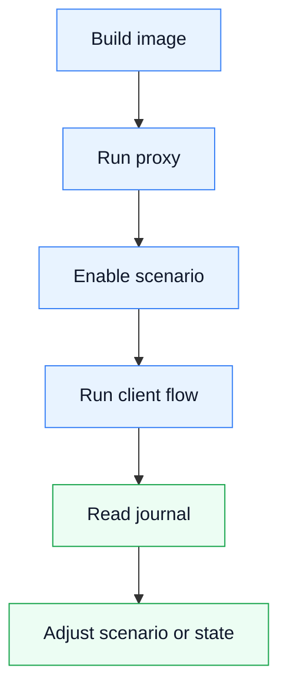

# MCP Proxy Runbook

## Start

```bash
./gradlew --no-daemon test
docker compose up -d --build mcp-proxy
docker compose logs -f mcp-proxy
```

The container starts MCP on `127.0.0.1:18082/mcp` and the proxy/admin runtime on `127.0.0.1:18081`.

## Normal Workflow



Use `scenario_enable` with `scenario`, `proxyPort`, `upstreamBaseUrl` and `stateDirectory`. Use `scenario_disable` to return runtime to passthrough mode.

## State

`var/state/runtime.json` is diagnostic persisted state. `var/state/journal/events.jsonl` contains request events. `var/state/kv/*.json` contains generic state store values.

## Logs

Readable stdout logs include scenario, method, path, mode, status, fixture, upstream URL and journal body file references.

Example:

```text
2026-04-28T09:00:00Z | INFO  | START   | proxy listening | scenario=passthrough | bind=0.0.0.0:18081 | upstream=https://example.com | state=/app/var/state
2026-04-28T09:01:00Z | INFO  | MOCK     | GET /v1/resource -> 200 | scenario=demo | mode=mock | fixture=demo/resource.json | requestBody=journal/bodies/request.json | responseBody=journal/bodies/response.json
```

## Checks

After Kotlin changes run Android Studio or IDEA inspections according to the repository instruction, then run `./gradlew --no-daemon test`. After launcher, Dockerfile or Compose changes also run `./gradlew --no-daemon installDist` and verify Docker/MCP startup.
