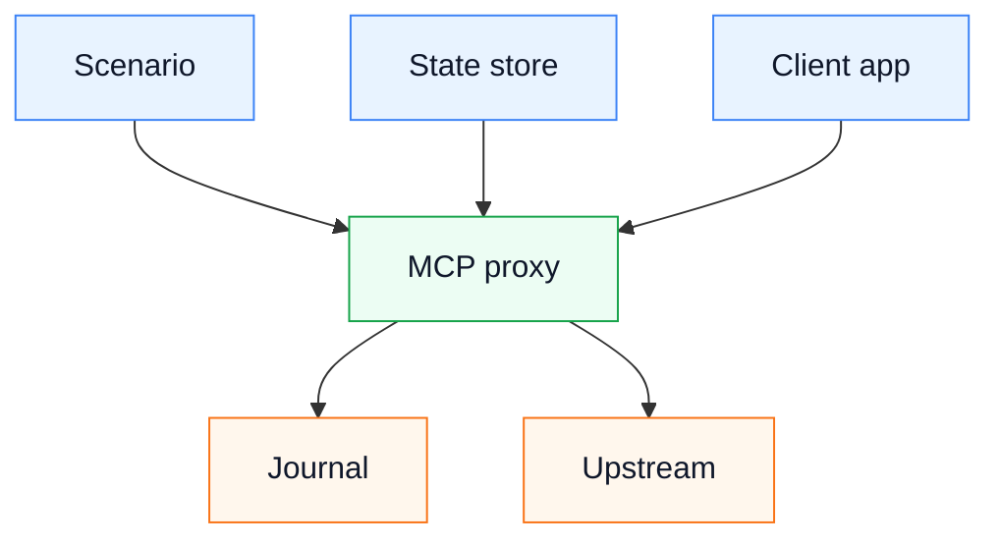

# MCP Proxy Emulator

Используй этот skill, чтобы проверить клиентский сценарий в локальном контуре через MCP proxy. Рабочая модель: клиент отправляет трафик в `10.0.2.2:<port>` или `127.0.0.1:<port>`, proxy применяет scenario rules (правила сценария), отдаёт fixtures (фикстуры), пишет journal (журнал), Codex управляет proxy через MCP tools (инструменты MCP), а Android Emulator управляется локально через host ADB.

## Инструменты

1. Найди доступные MCP tools через `tool_search`, если они ещё не загружены в контекст.
2. Для proxy нужны инструменты: `scenario_list`, `scenario_enable`, `scenario_status`, `scenario_disable`, `proxy_start`, `proxy_status`, `proxy_stop`, `journal_tail`, `state_get`, `state_set`, `state_delete`, `state_list`.
3. Для Android Emulator используй локальный `adb` с явным `-s <serial>`, когда устройств несколько.

## Проверочный Контур

Диаграмма фиксирует границу ответственности: MCP управляет proxy-сценариями и state store, клиент ходит через proxy, journal показывает фактическое сетевое поведение.

## Порядок Проверки

1. Получи список сценариев через `scenario_list`.
2. Включи нужный сценарий через `scenario_enable` с явными `scenario`, `proxyPort`, `upstreamBaseUrl` и `stateDirectory`.
3. Проверь `scenario_status` и `proxy_status`.
4. Настрой клиент на proxy host/port.
5. Выполни пользовательский сценарий в приложении.
6. Прочитай `journal_tail`, чтобы увидеть method, path, mode, fixture, status и body files.
7. Если сценарий зависит от изменяемого состояния, используй `state_get`, `state_set`, `state_delete`, `state_list`.

## State Store

State store является универсальным JSON-хранилищем для сценариев и ручных проверок. Каждый ключ хранится как `stateDirectory/kv/<key>.json`.

- `state_set` принимает `key` и raw JSON `value`;
- `state_get` возвращает raw JSON по ключу;
- `state_delete` удаляет ключ;
- `state_list` показывает ключи текущего state directory.

State store не содержит доменной логики клиента. Доменные мутации оформляй отдельным application-level механизмом только после явного решения в архитектуре.

## Диагностика

- Если mock response не сработал, сравни `method` и `path` из `journal_tail` с rules в scenario-файле.
- Если request ушёл в passthrough, проверь активный scenario и наличие правила.
- Если HTTPS не расшифровывается, проверь CA, system proxy и доверие клиента к сертификату.
- Если состояние выглядит старым, проверь `stateDirectory` и ключи через `state_list`.

## Артефакты

Для UI-сценария складывай временные артефакты в `/tmp/mcp-proxy-<task>/`: screenshot, UI dump, journal tail, status output и использованные state values.
